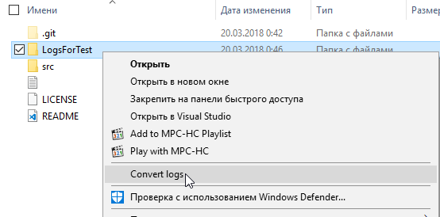

# StructuredLogsConverter

Utility for convert [Serilog compact JSON-based log-files](https://github.com/serilog/serilog-formatting-compact) to ordinal text-based log-files.

## Features

* Command line interface
* Search log-files in folders, sub-folders and zip archives
* Configurable template for output files
* Splitting logs on separate files by _Component_ tag (component list user can set manually)
* Configurable minimum log-level
* Version for full .Net 4.7 and .Net Core version
* Integration with windows explorer (only full .Net version)

